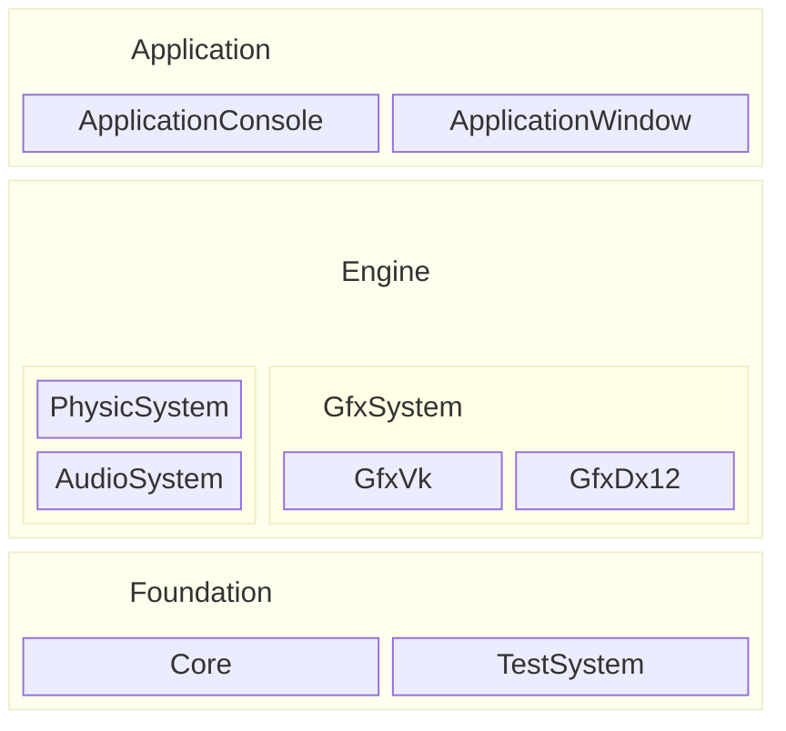

# Architecture Dependencies

This page describe the 10 000 feet view of the architecture of the engine. It show the dependencies between the different modules/component of the engine.

```mermaid
block-beta
  columns 3
  block:ApplicationGroup:3
    columns 2
    Application("Application"):2
    ApplicationConsole
    ApplicationWindow
  end

  block:EngineGroup:3
    columns 3
    Engine:3
    block:EngineGroupA:1
      columns 1
      PhysicSystem
      AudioSystem
    end  
    block:GfxSystemGroup:2
      columns 2
      GfxSystem:2
      GfxVk
      GfxDx12
    end
  end

  block:FoundationGroup:3
    columns 2
    Foundation:2
    Core
    TestSystem
  end

  %%ApplicationGroup --> EngineGroup
  %%EngineGroup --> FoundationGroup

  class Application BlockTitle
  class Engine BlockTitle
  class GfxSystem BlockTitle
  class Foundation BlockTitle
  classDef BlockTitle stroke:transparent,fill:transparent
```
